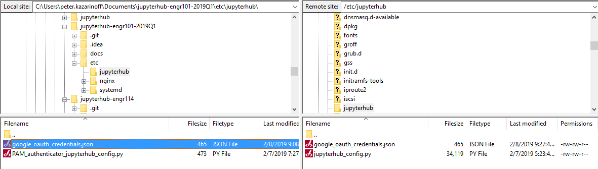

# Google Authentication

Now that the JupyterHub deployment works and we have two users set up on the server, we are going to get into the weeds of getting the Google authenticator to work. 

Why Google authenticator instead of just setting up users one by one at the command line? Our college uses the Gmail suite for both staff and students. When students log onto their college email, they are logging into Gmail. Students can use Google calendar and Google drive with their college email account as well. Instead of emailing students individual user names and passwords (and having students remember another set of usernames and passwords), students could log into JuypterHub using the same Google login that they use to access their college email, Google drive and calendar. It's just going to take a bit of work to get there.

[TOC]

## Google OAuth Instance

To allow students to use Google usernames and passwords to log into JupyterHub, the first thing we need to do is set up a Google OAuth instance. I set up the Google OAuth instance using my personal Gmail account, rather than my college Gmail account. Some parts of Google suite are not available in my college profile, like YouTube and developer tabs. 

To obtain the Google OAuth credentials, we need to log into the Google API console [https://console.developers.google.com/](https://console.developers.google.com/) and select [Credentials] on the lefthand menu.


Next we'll create a new OAuth credential under [Credentials] --> [Create Credentials] --> [OAuth client ID]:


To create a set of Google OAuth credentials we need to input:

 * Authorized JavaScript origins: ```https://mydomain.org```
 * Authorized redirect URIs: ```https://mydomain.org/hub/oauth_callback```


After clicking [Create] a problem surfaced. The Google OAuth dashboard noted that:

 > Invalid Origin: domain must be added to the authorized domains list before submitting


So click the [authorized domains list] link and enter the domain name for the JupyterHub server in the text box under [Authorized domains].


Then click [Submit for verification] and [Save]. For some reason the authorize domains submit for verification step and save step took a couple tries and more than a couple minutes. I don't know if Google is going a DNS lookup or what kind of verification steps they do - either way it took some time for the domain to be "verified".


Once the domain is verified, go back to the [Credentials] --> [Create Credentials] --> [OAuth client ID] screen and try entering in the [Authorized JavaScript origins] and [Authorized redirect URIs] again.


The scary red [Invalid Origin] should be absent as long as the domain has been verified.

After creating a new set of Google OAuth credentials, note the:

 * client ID
 * client secret
 

 
 The client ID and client secret strings will be included in our revised JupyterHub configuration.

## Pull out the client ID and client secret from the downloaded json file

For this JupyterHub Deployment, I also downloaded the json file that contains the client ID and client secret from Google's OAuth dashboard. You can access the json file containing the client ID and client secret by clicking the [Credentials] tab and find the credential you just created. On the right hand side is a download icon. Clicking this icon downloads a json file that contains our client ID and client secret.


After the json file downloads, you can open the json file in a web browser or a code editor. It has a structure that looks like this:

```text
{"web":
    {"client_id":"XXXXXXXXXXXXXXXXXXXXXXXXXXXXXXXXXXXXXXXXXXXXXXX.apps.googleusercontent.com",
    "project_id":"XXXXXXXXXXXXXXXXXXXXXXXXXXXXXXXXXXX",
    "auth_uri":"https://accounts.google.com/o/oauth2/auth",
    "token_uri":"https://oauth2.googleapis.com/token",
    "auth_provider_x509_cert_url":"https://www.googleapis.com/oauth2/v1/certs",
    "client_secret":"XXXXXXXXXXXXXXXXXXXXXXXXXXXXXXXXX",
    "redirect_uris":["https:XXXXXXXXXXXXXXX/hub/oauth_callback"],
    "javascript_origins":["https://eXXXXXXXXXXXX.org"]
    }
 }
```

On a local computer, rename the json file to ```google_oauth_credentials.json```. We can use Python and the ```json``` module from the Standard Library to pull out the ```"client_id"``` and ```"client_secret"``` from the json file. Make sure the json file is in the same directory on your local computer where the Python code is run.

Try the following Python code on your local computer:

```python
with open('google_oauth_credentials.json') as f:
    google_oauth = json.load(f)

print(google_oauth['web']['client_id'])
print(google_oauth['web']['client_secret']
```

The output will be the ```'client_id'``` and ```'client_secret'``` from the json file.

## Add the json file to .gitignore

Now we need to move the ```google_oauth_credentials.json``` to the sever, but before we do: **MAKE SURE TO ADD THE FILE TO .gitignore !!! WE DON'T WANT PRIVATE CREDENTIALS STORED ON GITHUB !!!**.

!!! warning
    <strong>Important!</strong> Do not save private credentials in a public GitHub repository! Keep your credentials private!

In ```.gitignore``` on my local machine, I added the following lines at the end. Note that locally this file is saved at ```projectroot/etc/jupyterhub/google_oauth_credentials.json```

```text
# .gitignore

...

## Config files

/etc/jupyterhub/config.json
/etc/jupyterhub/google_oauth_credentials.json

...

```

## Move the json file to the server

Now move the json file over to the server and save it in the ```/etc/jupyterhub/``` directory. I used FileZilla to move the json file over to the server instead of using copy-paste into PuTTY and the nano code editor.

Open FileZilla and select [File] --> [Site Manager... ]. Enter in the server's IP address and select the SSH key used to log into the server. Make sure to select:

 * [Protocal:] ```SFTP - SSH File Transfer Protocol```
 * [Host:] ```IP address of server```
 * [Port]: ```22```
 * [Logon Type:] ```Key file```
 * [User:] ```peter``` (or your non-root sudo user on the server)
 * [Key file:] [Browse...] and find the SSH key used to log onto the server


Click [Connect] to connect to the server with FileZilla.

Move both file browsers to ```/etc/jupyterhub```. On the local computer, the json file is present. On the server, only the jupyterhub config file is present.


Drag the json file over to the server side of the window.



Now that the json file is saved on the server, you can the FileZilla window.

After the json file is saved on the server, the contents of ```/etc/jupyterhub``` on the server should be:

```text
/etc/jupyterhub/
├── google_oauth_credentials.json
└── jupyterhub_config.py
```

## Modify jupyterhub_config.py

Once we get our Google OAuth credentials, we need to edit ```jupyterhub_conf.py``` again. Note your Google OAuth credentials are replaced by the credentials from the ```google_oauth_credentials.json``` file. I did the edits to the ```jupyterhub_config.py``` file locally in a code editor. There is a lot of places to miss type or miss copy and paste. You can move the revised ```jupyterhub_config.py``` file over to the server with FileZilla, just like we moved the json file.

```python
# /etc/jupyterhub/jupyterhub_config.py

# used to read the json google oauth config file
import json

# For Google OAuth
from oauthenticator.google import LocalGoogleOAuthenticator


c = get_config()

c.JupyterHub.log_level = 10
c.Spawner.cmd = '/opt/miniconda3/envs/jupyterhub/bin/jupyterhub-singleuser'

# Cookie Secret Files
c.JupyterHub.cookie_secret_file = '/srv/jupyterhub/jupyterhub_cookie_secret'
c.ConfigurableHTTPProxy.auth_token = '/srv/jupyterhub/proxy_auth_token'


# Google OAuth Login
c.JupyterHub.authenticator_class = LocalGoogleOAuthenticator

with open('/etc/jupyterhub/google_oauth_credentials.json') as f:
    google_oauth = json.load(f)

c.LocalGoogleOAuthenticator.client_id = google_oauth['web']['client_id']
c.LocalGoogleOAuthenticator.client_secret = google_oauth['web']['client_secret']

c.LocalGoogleOAuthenticator.oauth_callback_url = 'https://engr101lab.org/hub/oauth_callback' # replace with your domain
c.LocalGoogleOAuthenticator.create_system_users = True
c.Authenticator.add_user_cmd = ['adduser', '-q', '--gecos', '""', '--disabled-password', '--force-badname']
c.LocalGoogleOAuthenticator.hosted_domain = 'pcc.edu'   # replace with collegedomain.edu
c.LocalGoogleOAuthenticator.login_service = 'Portland Community College'  # replace with 'College Name'

# Users
#c.Authenticator.whitelist = {'peter','gabby'}
c.Authenticator.admin_users = {'peter','peter.kazarinoff'}
``` 

This little line:

```python
c.Authenticator.add_user_cmd = ['adduser', '-q', '--gecos', '""', '--disabled-password', '--force-badname']
```

was a real gottacha. Our college email addresses are in the form:

```firstname.lastname@college.edu```

When a student logs in, JupyterHub tries to create a new Linux user with a dot ```.``` in their username. Usernames with ```.``` doesn't work on Linux. I tried to create a new Linux user with a dot in their username, and the terminal asked me to use the ```--force-badname``` flag. So ```--force-badname``` is what we'll add to the ```c.Authenticator.add_user_cmd``` list. Otherwise, users (students) will be able to authenticate with Google, but they won't get a new user account on the server, and they won't be able to run notebooks or Python code.

## Install oauthenticator, restart JupyterHub and login

Before we can restart JupyterHub and try our Google OAuth configuration out, we need to install the Python package ```oauthenticator``` into the virtual environment that runs JupyterHub. Log onto the server, activate the virtual environment, and install ```oauthenticator``` with ```pip``` (```oauthenticator``` is not in any conda channels).

```text
$ conda activate jupyterhub
(jupyterhub)$ pip install oauthenticator
(jupyterhub)$ python

>>> import oauthenticator
>>> oauthenticator.__version__
'0.8.0'
>>> exit()

(jupyterhub)$ conda deactivate
$
```


Restart JupyterHub and browse to the web address attached to the server.

```
$ sudo systemctl stop jupyterhub
$ sudo systemctl start jupyterhub
$ sudo systemctl status jupyterhub
```

You should see **Active** in the status screen. If not, there is some trouble shooting to do. Use [Ctrl]+[c] to exit the status screen.

```text
● jupyterhub.service - JupyterHub
   Loaded: loaded (/etc/systemd/system/jupyterhub.service; disabled; vendor preset: enabled)
   Active: active (running) since Fri 2019-02-08 18:42:23 UTC; 6s ago
 Main PID: 9178 (jupyterhub)
    Tasks: 8 (limit: 1152)
```

## Log in with a Google username and password

If JupyterHub is running OK and there were no errors after the revisions to the ```jupyterhub_config.py``` file. Open a web browser and try to Log in.

The login window should now look something like:


We can log in with our Google user name and password (college username and password). 

Pretty sweet!

Note the Jupyter notebook file browser is empty after we log on. A new user was created by JupyterHub when we logged in. This new user's home directory is empty.


If you added your college username was added to the ```c.Authenticator.admin_users = { }``` set in ```jupyterhub_config.py```, you will be able to see an [Admin] tab when you click [Control Panel] in the Jupyter notebook file browser. If you click [Admin], you should see three users in the user list.


You can shut down the you college username's notebook server and logout (or play around with some notebooks).

After we log in using our college username and password, we can see if JupyterHub created a new user (with our college username) on the server. The command below produces a long list of users. This long list contains the non-root sudo user ```peter``` and the Google authenticated user (college username).

```text
$ awk -F':' '{ print $1}' /etc/passwd
....
uuidd
dnsmasq
landscape
sshd
pollinate
peter
gabby
peter.kazarinoff
```

<br>

## Summary

This was a big section and we got a lot accomplished. At the end of it, we have a running JupyterHub server that allows students and faculty to log into JupyterHub using their college useranmes and passwords. We accomplished this in a couple steps:

 * Create a Google OAuth instance in the Google Developer's console. Download and save the json file that stores the client ID and client secret.
 * Figure out how to pull the client ID and secret out of the json file using Python's json module from the Standard Library.
 * Add the json file to .gitignore so that our private client ID and private client secret are not made public.
 * Move the json file over to the server with FileZilla.
 * Modify the ```jupyterhub_config.py``` file. Add Google authentication to our JupyterHub configuration.
 * On the server, ```pip``` install **oauthenticator** into the virtual environment that runs JupyterHub.
 * Restart JupyterHub and login with a Google username and password.
 * Use the JuputerHub admin and the terminal to see the new user JupyterHub added to our server

## Next Steps

The next step is to make the login screen look like our college login screen. Right now, students see a orange button on the login screen. Next, we'll mess around with some templates, html and css to get our JupyterHub login screen to look a lot more like the college login screen.

<br>
