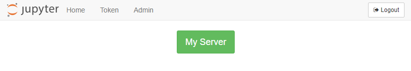
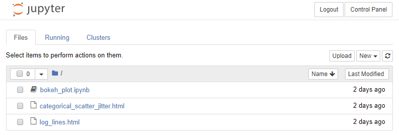

# Install JupyterHub

After the server is set up, and a non-root sudo user has been created, it is time to install JupyterHub on the server.

[TOC]

## Update System

It is probably best to update the packages installed on the server in case there are updates to the operating system and installed packages since the server was created. 

Open PuTTY and log into the server as the non-root sudo user we created in the last step. Then update the system:

```text
$ sudo apt-get update
$ sudo apt-get upgrade
```

<br>

## Install Miniconda

Before we install JupyterHub on the server, we need to install Python and create a virtual environment. We'll install Python using **Miniconda** and then use the **conda** package manager to create the virtual environment and install Python packages and JupyterHub. **Miniconda** is a lightweight version of **Anaconda**. **Miniconda** only comes with Python and the **conda** package manager. All of the Python packages that come with **Anaconda** are left out of **Miniconda**. This is just fine for us, since we are going to create a virtual environment anyway and don't need all of the packages that come with **Anaconda** in our JupyterHub deployment.

For this JupyterHub deployment, we'll install **Miniconda** in the ```/opt``` directory. The **Miniconda** install is lighter than the full **Anaconda** install, and we don't need all the packages and GUI applications that **Anaconda** provides. The packages that we need in this deployment of JupyterHub, we can install in a separate virtual environment. 

I followed [this tutorial](https://www.digitalocean.com/community/tutorials/how-to-install-the-anaconda-python-distribution-on-ubuntu-16-04) from Digital Ocean.

Go to [https://repo.continuum.io/archive/](https://repo.continuum.io/archive/) and look down the list of installs for the newest installer that corresponds to:

 * Miniconda3 (not Miniconda2, we don't want legacy Python version 2.7)
 * Linux
 * x86
 * 64 (bit)
 * .sh (linux shell script)

The URL of the latest Miniconda install for Linux will look something like:

```text
https://repo.continuum.io/miniconda/Miniconda3-latest-Linux-x86_64.sh
```

To downland and install Miniconda on the server, we'll use the ```curl``` command and run the bash installer from the command line:

```text
$ cd /tmp
$ curl -O $ https://repo.continuum.io/miniconda/Miniconda3-latest-Linux-x86_64.sh
$ sudo bash Miniconda3-latest-Linux-x86_64.sh
```

During the Miniconda install, accept the licence.  Then specify the following installation directory. This step ensures that Miniconda is installed in the ```/opt``` directory, which is where the JupyterHub docs specify user programs should reside.

```text
/opt/miniconda3/
```

During the installation, the installer script will ask:

```
Do you wish the installer to initialize Miniconda3
in your /home/peter/.bashrc ? [yes|no]
[no] >>> yes
```

Type ```yes```.

We want to be able to run **conda** from the command line. So make sure to allow **Miniconda** to append your PATH during the installation. After installation, we need to reload the ```.bashrc``` file because **Miniconda** made changes to our ```.bashrc``` during the install (when it added **conda** to our PATH).

```text
$ cd ~
$ source .bashrc
```

When the install is complete,  look in ```/opt```, and see the ```miniconda3``` directory.

```text
$ cd /opt
$ ls
miniconda3
```

## Change Miniconda3 Permissions

Now we need to deal with some permission issues. Since I am running as the user ```peter``` on the Digital Ocean server, I need to make sure the user ```peter``` has read, write, and execute permissions on the entire ```/opt/miniconda3/``` directory.

We can give ```peter``` user permissions with ```chmod``` and ```chown```.

```text
$ cd /opt
$ ls
miniconda3
$ ls -la
total 12
drwxr-xr-x  3 root root 4096 Oct 30 04:47 .
drwxr-xr-x 23 root root 4096 Oct 29 17:49 ..
drwxr-xr-x 13 root root 4096 Oct 30 04:47 miniconda3
```

Currently, the owner of the ```miniconda3``` directory is ```root``` and the group is ```root```. The owner ```root``` has read, write, execute privileges (```rwx```) and the group ```root``` has read, execute privileges (```r-x```), but no write privileges.

Let's modify the read, write, execute privileges so that the group ```root``` can read, write, and execute (```rwx```).

```text
$ sudo chmod -R g+w miniconda3/
$ ls -la
total 12
drwxr-xr-x  3 root root 4096 Oct 30 04:47 .
drwxr-xr-x 23 root root 4096 Oct 29 17:49 ..
drwxrwxr-x 13 root root 4096 Oct 30 04:47 miniconda3
```

OK, now let's change the group corresponding to the ```miniconda3/``` directory from ```root``` to ```peter```.

```text
$ sudo chown -R root:peter miniconda3/
$ ls -la
total 12
drwxr-xr-x  3 root root  4096 Oct 30 04:47 .
drwxr-xr-x 23 root root  4096 Oct 29 17:49 ..
drwxrwxr-x 13 root peter 4096 Oct 30 04:47 miniconda3
```

Now the user ```peter``` will be able to install packages using **conda** and **pip** in the Miniconda3 installation in the ```/opt``` directory.

Now that the permissions are changed, we should be able to run **conda** from the command line. Try:

```text
$ conda --version
```

If you see output, that means **Miniconda** was installed and **conda** can be run by the non-root user.

<br>

## Create a virtual environment and install and packages

For this JupyterHub install, we are going to create a conda environment (a virtual environment) and install packages into that environment. We'll call the conda environment ```jupyterhub``` and use ```python=3.7``` as our Python version. Then activate the ```jupyterhub``` environment and install **NumPy**, **Matplotlib**, **Pandas** and **Jupyter**. Also don't forget to install **xlrd**, this package is needed for **Pandas** to read ```.xlsx``` files. 

Finally, install **JupyterLab** and **JupyterHub** from the ```conda-forge``` channel.

```text
$ conda create -n jupyterhub python=3.7
$ conda activate jupyterhub
$(jupyterhub) conda install numpy matplotlib pandas xlrd jupyter notebook
$(jupyterhub) conda install -c conda-forge jupyterlab
$(jupyterhub) conda install -c conda-forge jupyterhub
```

<br>

## Run a very unsecured instance of Jupyter Hub just to see if it works

OK- let's give JupyterHub a whirl. We'll start JupterHub for the first time. Note the ```--no-ssl``` flag at the end of the command. This flag needs to be included or you won't be able to browse to the server. Also note we have to have our ```(jupyterhub)``` virtual environment active when we run the command. 

```text
$(jupyterhub) jupyterhub --no-ssl
```

We see some output in the PuTTY window. The last line is something like ```JupyterHub is now running at http://:8000/```. The first time I set up JupyterHub, I wasn't able to see the site using a web browser. No web page loaded, and the connection timed out.


Why? It turns out Digital Ocean installs a firewall called **ufw** by default and turns the **ufw** firewall on. When the server was created, ufw was configured to only allow incoming connections on ports 22, 80 and 433. The output below is shown when we first log into the Digital Ocean server:

```text
"ufw" has been enabled. All ports except 22 (SSH), 80 (http) and 443 (https)
have been blocked by default.
```

But **JupyterHub runs on port 8000** - it tells us so when JupyterHub starts. So we need to configure **ufw** to allow connections on port 8000 (at least for now, just to see if JupyterHub works). 

To allow communication on port 8000 and start JupyterHub, type:

```text
$(jupyterhub) sudo ufw allow 8000
# make sure the (jupyterhub) conda env is activated

$(jupyterhub) jupyterhub --no-ssl
```

Now we can browse to the server IP address of our Digital Ocean Droplet appended with ```:8000```. The web address should look something like: ```http://165.228.68.178:8000```. You can find the IP address of the server by going into the Digital Ocean dashboard. 

The JupyterHub login screen looks like:


Awesome! Quick log into JupyterHub using the username and password for the non-root sudo user (in my case ```peter```) that we set up earlier and are running as in our current PuTTY session. 

You should see the typical notebook file browser with all the files you can see when you run ```ls ~/```. Try creating and running a new Jupyter notebook. The notebook works just like a **Jupyter notebook running locally**.




<br>

## Quick! Log out and shut down JupyterHub

!!! warning
    <strong>Warning!</strong> You should not run JupyterHub without SSL encryption on a public network.

**Quick! Log out and shut down JupyterHub**. (does quick really matter in internet security?) The site is running without any ssl security over regular HTTP not HTTPS. Key in [Ctrl] + [c] to stop JupyterHub.

After you have confirmed that JupyterHub works, close off Port 8000 on the server by keying in the following command.

```text
$(jupyterhub) sudo ufw deny 8000
$(jupyterhub) sudo ufw status

Status: active

To                         Action      From
--                         ------      ----
OpenSSH                    ALLOW       Anywhere
8000                       DENY        Anywhere
OpenSSH (v6)               ALLOW       Anywhere (v6)
8000 (v6)                  DENY        Anywhere (v6)
```

## Summary

In this section, we installed **Miniconda** onto the server. We made sure **Miniconda** was installed in the ```/opt``` directory and then changed the directory permissions so that our non-root sudo user can use the **Miniconda** installation. 

Next we created a Python 3.7 virtual environment and installed NumPy, Matplotlib, Pandas, xlrd, and Jupyter into it. Then we installed JupyterLab and JupyterHub into the virtual environment from the ```conda-forge``` channel. Finally we ran a very un-secure instance of JupyterHub with no SSL encryption. 

**Running JupyterHub without SSL encryption is NOT ADVISED**.

## Next Steps

The next step is to acquire a domain name and link the domain name to our Digital Ocean server.

<br>
