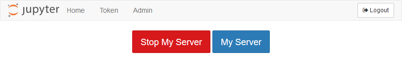
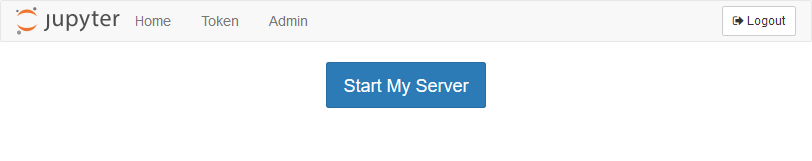

# JupyterLab Default Interface

Over the summer, when I ran JupterHub for the first time, we used the regular Jupyter notebook interface. There is an option when deploying JupyterHub to use the new JupyterLab interface instead.

[TOC]

## JupyterLab Interface

Below is the file browser running the regular Jupyter notebook interface. This is what students see now when they log into JupyterHub.


But students could also be greeted by the [**JupyterLab**](https://jupyterlab.readthedocs.io/en/stable/getting_started/overview.html) interface after they log in. Luckily, the JupyterLab interface is built right into JupyterHub. We can access the JupyterLab interface by logging into JupyerHub and modifying the URL.

Below is the URL when you are logged into the notebook file browser:

```text
https://mydomain.org/user/user.name/tree
```

In the URL, if we remove ```/tree``` and replace it with ```/lab``` the result is the JupyterLab interface.

```text
https://mydomain.org/user/user.name/lab
```

The resulting JupyterLab interface is shown below:


<br>

We can get back to the regular notebook interface by replacing ```/lab``` with ```/tree```.

<br>

The regular Jupyter notebook interface, running a notebook, is shown below:


If we switch to the JupyterLab interface, the same notebook looks like this:


## Modify jupyterhub_config.py

To use JupyterLab as the default landing page (instead of the regular notebook interface), add a line to ```jupyterhub_config.py``` in the ```/etc/jupyterhub/``` directory.

```python
# /etc/jupyterhub/jupyterhub_config.py

...

# Start Users at the JupyterLab Interface
c.Spawner.default_url = '/lab'

...
```

That's it. It's that easy to switch between the regular notebook and JupyterLab interfaces.


## Restart JupyterHub

After ```jupyterhub_config.py``` is saved, let's restart JupyterHub and see the results.

```text
$ sudo systemctl stop jupyterhub
$ sudo systemctl start jupyterhub
$ sudo systemctl status jupyterhub
# [Ctrl]+[c] to exit the status panel
```

When we log into JupyterHub, we are greated by the JupyterLab interface:


## Install JupyterLab extension for JupyterHub

One advantage of the good old classic notebook interface is it contains buttons to login and logout of JupyterHub, and buttons to start and stop our server. Login/logout and server start/stop controls are absent from the JupyterLab interface. Luckily, these controls can be added into JupyterLab with the [JupyterHub extension for JupyterLab](https://github.com/jupyterhub/jupyterlab-hub).

To install the JupyterLab extension for JupyterHub, log 
into the server, then activate the ```(jupyterhub)``` virtual environment. The extenion is installed with the command below:

```text
$ conda activate jupyterhub
(jupyterhub)$ jupyter labextension install @jupyterlab/hub-extension
```

I had to run this command twice to get the extension to install. Don't know why. The first time I ran the command, I was greeted by an error about installing or using **yarn**. But when I ran it a second time, it worked.

To use JupyterLab extension, add a line to ```jupyterhub_config.py``` in the ```/etc/jupyterhub/``` directory:

```python
# /etc/jupyterhub/jupyterhub_config.py

...

# Use the JupyterLab extension for JupyterHub.
# install with $ jupyter labextension install @jupyterlab/hub-extension
c.Spawner.cmd = ['jupyter-labhub']

...

```

## Restart JupyterHub

After ```jupyterhub_config.py``` is saved, restart JupyterHub and see the results.

```text
$ sudo systemctl stop jupyterhub
$ sudo systemctl start jupyterhub
$ sudo systemctl status jupyterhub
# [Ctrl]+[c] to exit the status panel
```

When we log into JupyterHub, we see the JupyterLab interface with a new [Hub] menu along the top:


If you select [Control Pannel], you end up with same buttons contained in the Jupyter notebook interface. 

If we [Stop My Server], then re-[Start My Server], we end up back in the JupyterLab interface.






## Summary

The JupyterLab interface is the newest Jupyter notebook interface created by the Jupyter project team. The JupyterLab interface includes a file browser in the left-hand side and the option of splitting up a window to show multiple notebooks.

Setting the JupyterLab interface as default is as simple as adding a custom URL to the ```jupyterhub_config.py``` file. If JupyterLab is the default interface, it is also helpful to add the JupyterHub extension for the JupyterLab interface. This extension adds the [Stop Server] and [Start Server] buttons to JupyterLab under a [Hub] menu item.

<br>
