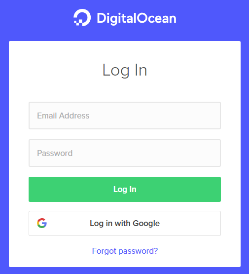
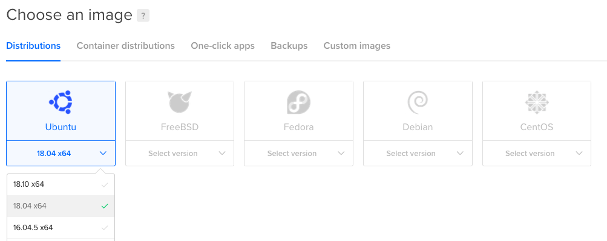
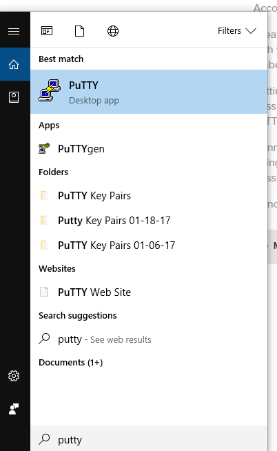
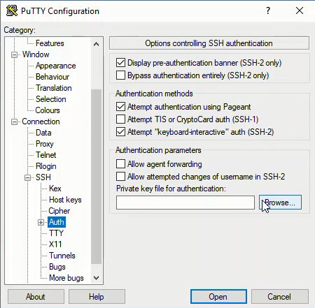
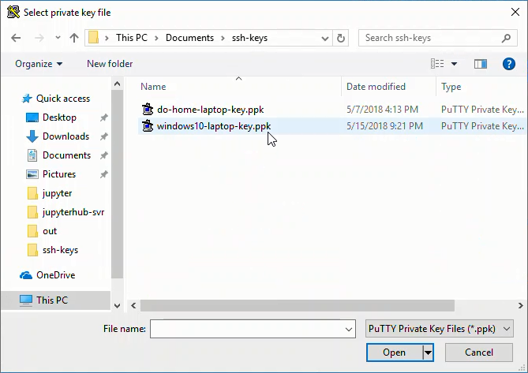

# Set Up Digital Ocean Server

To start the JupyterHub deployment process, we need to set up an Ubuntu 18.04 Server hosted by a cloud provider.

[TOC]

Digital Ocean is a cloud service provider like Amazon Web Services (AWS), Google Cloud, Microsoft Azure and Linode. Digital Ocean provides virtual private servers (called _droplets_ in Digital Ocean-speak) and online storage of static files (called _spaces_ in Digital Ocean-speak). 

We are going to run the JupyterHub server on a Digital Ocean _droplet_. I like Digital Ocean's prices and web interface. The documentation on Digital Ocean is pretty good too. I already have a Digital Ocean account. I don't remember exactly how I signed up for my Digital Ocean account, but going to this link:

[https://www.digitalocean.com/](https://www.digitalocean.com/)

and selecting [Sign Up](https://cloud.digitalocean.com/registrations/new) should work.


## Create a new Digital Ocean Droplet

To create a new Digtial Ocean Droplet (a new server), log in here:

[https://cloud.digitalocean.com/login](https://cloud.digitalocean.com/login)



After logging in, I got a verify screen and had to grab my phone and retrive a six digit code. Ah... the joys of two-factor authentication.


Once you login, the Digital Ocean dashboard looks like this. To create a new project, select [+ New Project]. 


Give the project a name, description and click [Create Project]. After the project is created, we need to add a new _Droplet_ (server) to our project. Click the [Create] dropdown and select [Droplets].


There are a number of choices to make. These are the ones I selected:

 * Image: Ubuntu 18.04 x64
 * Size: 1 GB Memory 25GB SSD $5/month
 * Datacenter: San Fransisco 2
 * Add your SSH keys: New SSH Key
 * Finalize: 1 Droplet, Hostname: jupyterhub-engr114




## Add an SSH Key

!!! warning
    <strong>Important!</strong> You need to add the public SSH key BEFORE creating the droplet

The public SSH key we created needs to be shown on the list of keys and the radio box beside it needs to be checked. If the SSH key isn't listed or the SSH key box left  unchecked, the SSH key will not be added to the server when the server is first created (and then we won't be able to log in with PuTTY). We need to add our public SSH key and check the key box so we can log onto the server with PuTTY.

Under [Add your SSH keys], click [New SSH Key]. A dialog window pops up:


Paste the contents of the public SSH key into the [New SSH Key] dialog box.


Enter a name for the SSH key that will be saved on Digital Ocean. Then click [Add SSH Key]


Then you should see the new SSH Key in the [Add your SSH Keys?] region of the new droplets page. Make sure that the radio box for the SSH key you just added is checked. 

A problem I had when I set up my first _droplet_ was that I did not have the SSH Key was radio button selected. Therefore, when the server was created, no SSH keys were installed. 

It is _way easier_ to insert SSH keys into the server when the server is created. It is _way harder_ to add an SSH keys after the server is created.

At the bottom of the New Droplet Creation screen in the **Finalize and create** section, make sure to enter a recognizable for the server and ensure the server is added to the project we created earlier


Click the long green [Create] button at the bottom of the page to create the Droplet.

After Droplet creation, you end up at the Digital Ocean main dashboard. Our new Droplet can be seen under [Resources] --> [Droplets].


Note the IP address of the new droplet. We need to IP address to log into our server with PuTTY. Copy the IP address of the droplet to the clipboard.

## Log into the server as root over SSH using PuTTY.

Open PuTTY from the Windows start menu. A couple other parameters need to be set before we log onto the server.

| parameter | value |
| --- | --- |
| IP Address | IP of _droplet_ ex: 168.97.14.19 |
| Port | 22 |
| Connection --> SSH --> Auth --> Private key file | private SSH key |
| Connection --> Data --> Auto-login username | root |



Under Connect --> SSH --> Auth --> Private key file for authentication:, click [Browse]. 



Navigate to the SSH private key. The private key ends in a ```.ppk``` extension. I had trouble finding the key when I first set up PuTTY. It turned out that when the key was saved in the ```Programfiles\PuTTY``` folder. The key was not visible in the Windows file browser because I don't have administrator permissions on my machine at work. I ended up having to create a new SSH key and save the new key in ```Documents\ssh-key``` (I can access ```Documents\ssh-key``` without administrator privaleges).



Under Connection --> Data --> Auto-login username: ```root```


Back in [Sessions] (the top-most menu item or main page), add the IP address and Port = 22, click [Open]


This brings up a new window that is a terminal for our server:


## Create a non-root sudo user

Digital Ocean recommends that the servers are run by a non-root user that has sudo access. So after an update, the thing we'll do on our server is create a non-root sudo user. 

First, let's make sure everything is up to date:

```text
$ sudo apt-get update
$ sudo apt-get upgrade
```

I followed [this tutorial](https://www.digitalocean.com/community/tutorials/how-to-create-a-sudo-user-on-ubuntu-quickstart) from Digital Ocean to create a non-root sudo user.

Create the new user with the ```adduser``` command. I called my new user ```peter```.
  
```text
$ adduser <username>
```

Set a new password and confirm:

```text
Enter new UNIX password:
Retype new UNIX password:
passwd: password updated successfully
```

The user details can be skipped by pressing [Enter]. Then [Y] to complete the new user setup.

```text
Changing the user information for username
Enter the new value, or press ENTER for the default
    Full Name []:
    Room Number []:
    Work Phone []:
    Home Phone []:
    Other []:
Is the information correct? [Y/n]
```

Now let's give our new user sudo privaleges:

```text
$ usermod -aG sudo <username>
```

The new user account is created and the new user has sudo privileges. We can switch accounts and become the new user with:

```text
$ sudo su - <username>
```

The new user should have ```sudo``` privileges. This means when acting as ```<username>``` we should be able to look in the ```/root``` directory.

```text
$ sudo ls -la /root
```

If you can see the contents of ```/root``` then the new user is set up with sudo access.

To exit out of the new sudo user, and get back to using the root profile, type ```exit``` at the prompt. But don't close the PuTTY terminal yet. Stay logged in as ```root``` for one more step.

```text
$ exit
```

## Add SSH keys to new user's profile

Before we log off, we need to add our SSH keys to our new user's profile on the server. The second time I set up JupyterHub, I had trouble logging in as the non-root user using PuTTY. I could log in as ```root``` just fine, but I could not log in as the newly created user ```peter```.

 When Digital Ocean created the server, the SSH keys (specified on the creation page) were added to the ```root``` profile. The new user ```peter``` didn't exist when the server was created. The only user on the server at creation time was ```root```. Therefore, no SSH keys were added to the ```peter``` profile at server creation time- because the user ```peter``` didn't exist yet. 
 
 Since we want to log into our server as the new non-root user ```peter```, we need to add the same SSH keys saved in the ```root``` profile to the ```peter``` profile. The SSH keys belong in a file located at ```/home/peter/.ssh/authorized_keys```. 

This little line will copy the ssh keys from the root profile to the new user's profile. The line comes from [this tutorial](https://www.digitalocean.com/community/tutorials/initial-server-setup-with-ubuntu-18-04) by Digital Ocean.

```text
$ rsync --archive --chown=peter:peter ~/.ssh /home/peter
```

Next, we need to open the ufw firewall to OpenSSH traffic. We we'll communicate with the server over SSH and need the ufw firewall to allow this type of communication through.

```text
$ ufw allow OpenSSH
$ ufw enable
$ ufw status
```

We can see that OpenSSH is now allowed.

```text
Status: active

To                         Action      From
--                         ------      ----
OpenSSH                    ALLOW       Anywhere                  
OpenSSH (v6)               ALLOW       Anywhere (v6)             
```

Now we can exit out of the ```root``` profile. This terminates the PuTTY session.

```text
$ exit
```

## Connect to the server as the non-root sudo user using PuTTY

Now that the non-root sudo user is set up and our ssh keys are in ```/home/<user>/.ssh/authorized_keys/```, let's start a new PuTTY session and log into the server as the new user. 

Like before, open PuTTY from the Windows Start menu and add the following settings, but this time the **Auto-login user name** is the name of our new non-root sudo user:

| parameter | value |
| --- | --- |
| IP Address | IP of _droplet_ ex: 168.97.14.19 |
| Port | 22 |
| Connection --> SSH --> Auth --> Private key file | private SSH key |
| Connection --> Data --> Auto-login username | peter |

I also saved the PuTTY session details at this point so that I wouldn't have to re-enter all of the parameters each time I want to log into the server. Enter a name into [Saved Sessions] and click [Save]. Once the parameters are saved in PuTTY, you can simply double-click the profile name to log into the server.


Log into the server with Sessions --> [Open]
  
You should see the Digital Ocean login screen again. Note the command prompt will have the new user's name before the ```@``` symbol. 


Check to see which directory you land in. It should be ```/home/<username>```

```text
$ pwd
/home/<username>
```

We can see the non-root user's home directory. Let's also make sure we can see into the ```root``` user's home directory. If we can view the contents of the ```/root``` directory, we know the non-root sudo user has sudo privileges.

```text
$ sudo ls -la /root
```
The contents of the ```/root``` directory should include a ```.bashrc``` file and a ```.ssh``` directory.

```text
...
-rw-r--r--  1 root root 3106 Apr  9  2018 .bashrc
drwx------  2 root root 4096 Feb  6 00:29 .cache
-rw-r--r--  1 root root    0 Feb  6 00:24 .cloud-locale-test.skip
drwx------  3 root root 4096 Feb  6 00:29 .gnupg
-rw-r--r--  1 root root  148 Aug 17  2015 .profile
drwx------  2 root root 4096 Feb  6 00:24 .ssh
```

To log out of the server simply type ```exit```. The ```exit``` command closes the PuTTY session.

```text
$ exit
```

## Summary

In this section, we accomplished a lot. First we created an account on Digital Ocean and logged into the Digital Ocean Dashboard. Then we created a new project on Digital Ocean. Next we created a new Digital Ocean Droplet (a new server) and made sure the new Droplet had our SSH keys saved when the Droplet was created. After we created the Droplet, we logged into the server as ```root``` and created a new non-root sudo user. Before we exited out of the root profile, we make sure to save the SSH keys from the root user's profile and add these SSH keys to the non-root sudo user's profile. Finally we logged into the server as the non-root sudo user and made sure that user has sudo privileges. 

## Next Steps

The next step is to install Python and JupyterHub on the server. In particular, we will install **Miniconda**, create a virtual environment, and install **JupyterHub** into the virtual environment.

<br>
